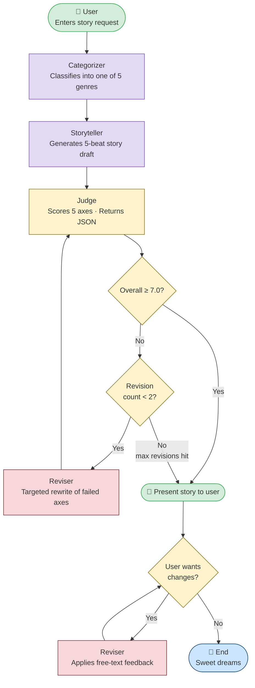

# System Block Diagram

---

## Component Walkthrough

### 1. User
The entry point. The user types a free-text story request (e.g. *"A funny story about a penguin who wants to fly"*). Input can be anything — a single sentence, character names, a setting, a mood. The pipeline handles ambiguity downstream.

---

### 2. Categorizer
**Role:** Classify the request into one of five genres so every downstream component can apply the right strategy.

**Genres:** `adventure` · `friendship` · `silly/funny` · `calming-bedtime` · `educational`

**Prompting strategy:** Zero-shot classification with `temperature=0.0` for determinism. The prompt lists each category with defining traits (e.g. *"calming-bedtime: peaceful, gentle, soothing, stars, cozy, sleep"*) and demands a strict JSON response `{category, reason}`. JSON output means the arc selector and storyteller can branch on category without another LLM call. A fallback catches any parse failure and defaults to `adventure`.

---

### 3. Storyteller
**Role:** Generate the full story draft (~350–500 words) structured as a five-beat narrative arc.

**Arc enforced:** `## Setup` → `## Inciting Incident` → `## Rising Action` → `## Climax` → `## Resolution`

**Prompting strategy:** Two-part prompt — a category-specific **system prompt** and a structured **user prompt**.

- The system prompt sets a persona and tone rules tailored to the genre. Examples:
  - `adventure` → *"Short, punchy sentences. Build tension steadily. The hero earns their victory through bravery or cleverness, not luck."*
  - `calming-bedtime` → *"Longer, lilting sentences. Soft imagery: moonlight, stars, cozy blankets. No loud moments or unresolved tension."*
  - `silly/funny` → *"Pack in absurd situations. Use sound effects (SPLAT! BOING!). The climax should be the funniest moment."*

- The user prompt names each arc section explicitly as a labeled header, which forces the model to produce structure rather than hope for it. `temperature=0.75` for creative latitude within the constraints.

---

### 4. Judge
**Role:** Evaluate the story on five scored axes and identify which ones need fixing.

**Axes (each scored 1–10 with written feedback):**

| Axis | What it measures |
|---|---|
| `age_appropriateness` | Vocabulary and content right for ages 5–10 |
| `safety` | Free from frightening, violent, or inappropriate content |
| `story_arc` | All five beats present and satisfying |
| `engagement` | Vivid, emotionally resonant, fun for a child |
| `length_fit` | Not rushed, not long enough to lose a young reader |

**Output:** Structured JSON including per-axis `score` and `feedback`, a recomputed `overall` average, a `passes_threshold` boolean (`overall ≥ 7.0`), and a `priority_fixes` list sorted worst-first.

**Prompting strategy:** Strict rubric-based evaluation with `temperature=0.0` so scores are consistent across runs. The system prompt calibrates scoring ("a mediocre story scores 5–6, solid is 7–8, exceptional is 9–10") to prevent grade inflation. Derived fields (`overall`, `passes_threshold`, `priority_fixes`) are recomputed in code from the raw scores — the model only needs to produce the per-axis numbers, reducing the surface area for hallucination.

---

### 5. Reviser (Auto)
**Role:** Perform a surgical rewrite targeting only the axes the judge flagged as failing (score < 7).

**Prompting strategy:** The revision prompt is built dynamically — only failed axes and their specific judge feedback are included in the `JUDGE FEEDBACK TO ADDRESS` block. The model is explicitly told to preserve everything that scored 8 or higher and not to rewrite the whole story. `temperature=0.6` keeps edits focused. The loop runs at most **2 times** before the best available version is presented, preventing infinite quality-chasing.

---

### 6. User Feedback Loop
**Role:** Let the reader (child or parent) request changes in plain language after seeing the story.

**Prompting strategy:** Free-text feedback is passed to a lightweight revision prompt that applies only the requested change while preserving the five-beat arc structure. `temperature=0.7` allows the model to be responsive and creative in interpreting vague requests like *"make it funnier"* or *"give the cat a name."* The loop repeats until the user presses Enter with no input.
